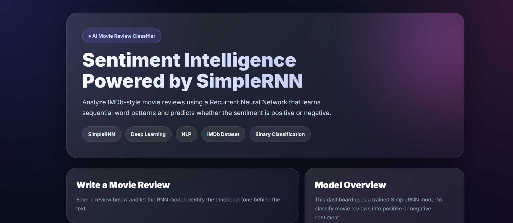

# IMDb Sentiment Analysis using SimpleRNN

A Deep Learning-based Sentiment Analysis System that automatically classifies IMDb movie reviews as **Positive** or **Negative** using a **Simple Recurrent Neural Network (SimpleRNN)**. The project includes an interactive Streamlit web application for real-time sentiment prediction.

---


## Application Preview



---

## Project Overview

Sentiment Analysis is a Natural Language Processing (NLP) task that identifies the emotional tone of textual data. In this project, a SimpleRNN model is trained on the IMDb Movie Reviews dataset to learn sequential word patterns and classify reviews into positive or negative sentiments.

The trained model is integrated with a modern Streamlit application that allows users to enter movie reviews and receive instant sentiment predictions along with confidence scores.

---

## Features

- IMDb Movie Review Sentiment Classification
- Deep Learning using SimpleRNN
- Automatic Text Preprocessing
- Positive & Negative Sentiment Prediction
- Confidence Score
- Sentiment Gauge
- Modern Glassmorphism Streamlit Dashboard
- Real-Time Prediction

---

## Technologies Used

- Python
- TensorFlow / Keras
- SimpleRNN
- NumPy
- Scikit-learn
- Matplotlib
- Streamlit
- Pickle

---

## Project Structure

```
imdb-sentiment-analysis-rnn/
│
├── app.py
├── sentiment_rnn_model.keras
├── word_index.pkl
├── requirements.txt
├── README.md
└── Sentiment_Analysis_RNN.ipynb
```

---

## Dataset

- **Dataset:** IMDb Movie Reviews
- **Source:** TensorFlow/Keras Datasets
- **Training Samples:** 25,000
- **Testing Samples:** 25,000

The dataset is automatically downloaded from TensorFlow/Keras during training, so no manual dataset download is required.

---

## Model Architecture

```
Embedding Layer
        │
        ▼
SimpleRNN Layer (64 Units)
        │
        ▼
Dropout Layer
        │
        ▼
Dense Layer (Sigmoid)
```

---

## Model Performance

| Metric | Score |
|---------|-------|
| Test Accuracy | **77.58%** |
| Precision | **0.78** |
| Recall | **0.78** |
| F1-Score | **0.78** |

---

## Application Preview

### Dashboard

> Add a screenshot here

```
images/dashboard.png
```

---

## Installation

Clone the repository

```bash
git clone https://github.com/shifanaccc/imdb-sentiment-analysis-rnn.git
```

Navigate to the project folder

```bash
cd imdb-sentiment-analysis-rnn
```

Install the dependencies

```bash
pip install -r requirements.txt
```

Run the application

```bash
streamlit run app.py
```

---

## How It Works

1. Enter a movie review.
2. The review is cleaned and tokenized.
3. Words are converted into integer sequences.
4. The sequence is padded to a fixed length.
5. The trained SimpleRNN model predicts the sentiment.
6. The application displays:
   - Predicted Sentiment
   - Confidence Score
   - Sentiment Gauge

---

## Learning Outcomes

- Natural Language Processing (NLP)
- Text Preprocessing
- Deep Learning using SimpleRNN
- Binary Text Classification
- TensorFlow/Keras Model Development
- Streamlit Deployment
- End-to-End AI Application Development

---

## Future Improvements

- LSTM and GRU model comparison
- Multi-class sentiment classification
- Attention Mechanism
- Transformer-based models (BERT)
- Model optimization and hyperparameter tuning
- Docker deployment

---

## Author

**Shifana CC**

Artificial Intelligence & Data Science Student

---
